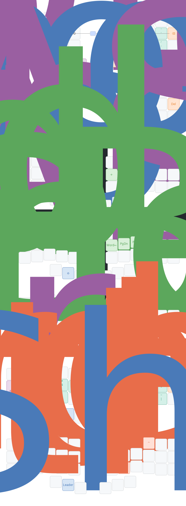

# Xavier's Kaly42 Keymap

A split keyboard layout emphasizing **minimal finger travel**, **platform independence**, and **semantics**. As a user who regularly switches from MacOS to Linux, I needed a keyboard that provides a consistent experience across devices.



## Philosophy

This keymap doesn't stand in the way between you and your operating system. Instead of memorizing different shortcuts for each platform, you use semantic commands that automatically translate to the correct keystroke(s) for your current OS.

## Ergonomics

This layout is built around **biomechanical constraints** rather than traditional keyboard conventions. Every key placement respects the natural range of motion for each finger:

### Pinky Fingers: Downward and Lateral Only

Pinkies are optimized for **downward** and **1U lateral (outward)** movement from home position. They never reach:
- **Upward** - pinky extension is weak and fatiguing
- **Diagonal** - combining upward + lateral compounds the strain

This constraint motivated:

- the **weak corners feature**: rather than forcing your pinkies into uncomfortable diagonal reaches for corner keys, those positions become accessible via comfortable combos from adjacent home-area keys.
- The outer columns use **only the middle row position** (one key per hand at the home row level). The top and bottom positions in the outer columns remain empty.

### Index Fingers: Avoiding Inner Diagonals

Index fingers handle a wide range, but **inner diagonal reaches** are awkward and slow. Specifically, the inward-diagonal movement from index home position (F/J positions in QWERTY) toward the inner column (like reaching for B/N in QWERTY) creates an uncomfortable hand twist.

### Thumb Clusters: 2 Keys

The layout uses **2-key thumb clusters** supplemented by the outer pinky home-row key, rather than 3-key thumb arcs. This design choice prioritizes accuracy and consistency:

- **Reduced misfire risk** - Fewer thumb keys means clearer spatial separation and more distinct hand positions
- **Better proprioception** - 2 thumb positions are easier to locate reliably without looking
- **Pinky lateral is predictable** - The outward pinky reach to the outer column home-row key is comfortable and consistent, unlike thumb arcs where the third key often requires awkward extension or rotation

### The Result: Comfort Over Convention

Your fingers stay closer to home position, moving in their strongest, most natural directions.

## Features

### Alternative Symbol Systems

Two optional features for improved symbol access:

1. **Base Layer Alt Symbols** - Replaces semicolon row with programming-friendly symbols when weak corners are enabled
2. **Alternative SYMBOLS Layer** - Reorganizes number/symbol layer with inverted pairs (`{` defaults to tap, `[` to shift) and custom number behaviors (`1` → `@` when shifted)

Both use QMK's key override system with custom keycodes for clean, layer-scoped behavior.

### Weak Corners Feature

Optional **lazy/weak corners** reduce long diagonal travels for less frequently used keys. When enabled (`XC_WEAK_CORNERS=yes`), corner keys can be accessed via combos from adjacent positions, keeping your fingers closer to home position during rapid typing.

This geometry prioritizes **comfort over key count** - every key placement considers the biomechanics of reaching it hundreds of times per day.

## Key Features

### Platform-Aware Semantic Keys

> ![NOTE] 
> This feature is heavily inspired by HandsDown. 

Common operations work identically across platforms:

- **Undo/Cut/Copy/Paste** - Use the same keys regardless of OS (Cmd vs Ctrl abstracted away)
- **Special Characters** - Euro (€), Cedilla (ç), and Ñ with platform-specific input methods
- **Text Navigation** - Word/line/document movement using consistent keybindings
- Applivcation switch

The semantic key system uses **keycode sequences** to handle complex inputs like dead keys + letter combinations, ensuring reliable cross-platform character entry.

### Accents on Dead Keys

Type accented characters naturally using OS-native dead key triggers:

- **Acute (´)**: á é í ó ú ý
- **Grave (`)**: à è ì ò ù
- **Circumflex (^)**: â ê î ô û
- **Diaeresis (¨)**: ä ë ï ö ü ÿ
- **Tilde (~)**: ã ñ õ

### Callum-Style Oneshot Modifiers

Optimized for rolling combos rather than holding:

- Tap a modifier (Shift/Ctrl/Alt/GUI), then tap your key - no holding required

Works seamlessly with semantic keys and shift morphing.


### Alternative Symbol Systems

**Base Layer Alternative Symbols** (feature `XC_ALT_BASE_SYMBOLS`):

When enabled with weak corners, replaces standard punctuation with more accessible alternatives for programming and writing:

- `'` / `"` (instead of `;` / `:`)
- `,` / `?` (instead of `,` / `<`)
- `.` / `!` (instead of `.` / `>`)
- `-` / `/` (instead of `/` / `?`)
- `_` / `|` (replaces semicolon position when using alternative layouts)

Implemented using QMK's key override system with custom keycodes (AS_*) for clean, maintainable code.

**Alternative SYMBOLS Layer** (`XC_ALT_SYMBOLS_LAYER`):

Optional reorganization of the SYMBOLS layer optimized for programming:

- **Non-standard shift behaviors**: Numbers produce symbols like `1/@`, `2/$`, `3/%`, `4/#` instead of standard shifted symbols
- **Inverted pairs**: Common brackets/symbols default to their shifted position for faster access:
  - `{` / `[` (tapped gives `{`, shifted gives `[`)
  - `}` / `]` (tapped gives `}`, shifted gives `]`)
  - `:` / `;` (tapped gives `:`, shifted gives `;`)
  - `|` / `~` (tapped gives `|`, shifted gives `~`)

All custom behaviors use dedicated keycodes (SL_*) and key overrides, maintaining the data-driven architecture.

### 🔧 Technical Implementation

**Data-Driven Design**:
- Lookup tables with C99 designated initializers for clarity
- Sequences support up to 3 keycodes for complex inputs
- Platform abstraction handled at the feature level, not scattered through keymap code
- Custom keycodes + key overrides for clean symbol morphing

**Feature Modularity**:
- `semantic_keys.c` - Platform-independent commands (Undo, Cut, Euro, etc.)
- `dead_keys.c` - OS dead key triggers
- `oneshot.c` - Callum-style oneshot modifiers
- `mod_morph.c` - Shift morphing system
- `os_control.c` - Runtime OS detection and switching
- `alt_symbols.c` - Alternative base layer symbols
- `alt_symbols_layer.c` - Alternative SYMBOLS layer configuration

**Proper Layering**:
- Dead keys processed before semantic keys
- Oneshot modifiers integrate cleanly with morphing
- No race conditions or modifier leakage
- Key overrides scoped to specific layers where needed

## Layout Philosophy

### Base Layer
- **Home row mods** avoided - oneshot modifiers provide better ergonomics
- **High-frequency keys** on strongest fingers
- **Thumb cluster** handles space, layers, and shift/leader combo

### Layer Access
- **FAVS** layer on right thumb for frequently used symbols/numbers
- **NAV** layer for navigation
- **SYMBOLS** layer for numbers and symbols
- Layer lock available for sustained layer use

## Building

This keymap is part of a QMK userspace setup. To compile:

```bash
qmk compile -kb kaly/kaly42 -km xavier
```

To compile for a different base layout (default is QWERTY):

```bash
XC_LAYOUT=graphite qmk compile -kb kaly/kaly42 -km xavier
```

Supported layouts: `qwerty`, `gallium`, `focal`, `graphite`

### Feature Flags

The keymap supports several optional features controlled via environment variables or `rules.mk`:

- **`XC_WEAK_CORNERS`** (default: `yes`) - Enables lazy corner keys accessible via combos
- **`XC_ALT_BASE_SYMBOLS`** (auto-enabled with weak corners) - Alternative base layer symbols for better programming/writing ergonomics
- **`XC_ALT_SYMBOLS_LAYER`** (default: `no`) - Alternative SYMBOLS layer with inverted pairs and custom shift behaviors

Example with all options:

```bash
XC_LAYOUT=graphite XC_ALT_SYMBOLS_LAYER=yes qmk compile -kb kaly/kaly42 -km xavier
```

**Note**: `XC_ALT_BASE_SYMBOLS` is automatically enabled when `XC_WEAK_CORNERS=yes` as the alternative symbols complement the weak corner layout.

## Customization

The keymap uses a **macro-based custom keycode system** for clean, maintainable feature additions:

### Adding Semantic Keys

All feature keycodes use the `CUSTOM_KEYCODES()` macro pattern:

1. Add keycode list to feature header (e.g., `semantic_keys.h`):
   ```c
   #define SEMANTIC_KEYS_LIST CUSTOM_KEYCODES(SEMANTIC_KEYS, \
       SK_UNDO, \
       SK_CUT, \
       SK_COPY \
   )
   ```

2. Include the list in `custom_keycodes.h` enum:
   ```c
   enum custom_keycodes {
       ...
       SEMANTIC_KEYS_LIST,
       ...
   };
   ```

3. Add mapping to feature's lookup table (e.g., `semkey_table` in `semantic_keys.c`)

This approach auto-generates start markers, individual keycodes, and count values, eliminating manual index management and reducing errors.

### Adding Alternative Symbols

Follow the same pattern used by `alt_symbols.h` and `alt_symbols_layer.h`:

1. Define keycode list with `CUSTOM_KEYCODES()` macro
2. Create `*_OVERRIDE()` macro for key override generation
3. Include list in `custom_keycodes.h` enum
4. Add overrides to `key_overrides[]` array in `keymap.c`

See `features/alt_symbols_layer.h` for a complete example of layer-scoped key overrides with inverted shift behaviors.

## Inspiration

- **Callum-style oneshot modifiers** - For superior ergonomics over home row mods
- **Precondition's approach** - Platform-aware key handling philosophy
- **HandsDown semantic keys** - Extended navigation and editing commands (commented out, ready to enable)

## License

GPL-2.0-or-later (following QMK licensing)


# QMK instructions (from the original repository)

## Howto configure your build targets

1. Run the normal `qmk setup` procedure if you haven't already done so -- see [QMK Docs](https://docs.qmk.fm/#/newbs) for details.
1. Fork this repository
1. Clone your fork to your local machine
1. Enable userspace in QMK config using `qmk config user.overlay_dir="$(realpath qmk_userspace)"`
1. Add a new keymap for your board using `qmk new-keymap`
    * This will create a new keymap in the `keyboards` directory, in the same location that would normally be used in the main QMK repository. For example, if you wanted to add a keymap for the Planck, it will be created in `keyboards/planck/keymaps/<your keymap name>`
    * You can also create a new keymap using `qmk new-keymap -kb <your_keyboard> -km <your_keymap>`
    * Alternatively, add your keymap manually by placing it in the location specified above.
    * `layouts/<layout name>/<your keymap name>/keymap.*` is also supported if you prefer the layout system
1. Add your keymap(s) to the build by running `qmk userspace-add -kb <your_keyboard> -km <your_keymap>`
    * This will automatically update your `qmk.json` file
    * Corresponding `qmk userspace-remove -kb <your_keyboard> -km <your_keymap>` will delete it
    * Listing the build targets can be done with `qmk userspace-list`
1. Commit your changes

## Howto build with GitHub

1. In the GitHub Actions tab, enable workflows
1. Push your changes above to your forked GitHub repository
1. Look at the GitHub Actions for a new actions run
1. Wait for the actions run to complete
1. Inspect the Releases tab on your repository for the latest firmware build

## Howto build locally

1. Run the normal `qmk setup` procedure if you haven't already done so -- see [QMK Docs](https://docs.qmk.fm/#/newbs) for details.
1. Fork this repository
1. Clone your fork to your local machine
1. `cd` into this repository's clone directory
1. Set global userspace path: `qmk config user.overlay_dir="$(realpath .)"` -- you MUST be located in the cloned userspace location for this to work correctly
    * This will be automatically detected if you've `cd`ed into your userspace repository, but the above makes your userspace available regardless of your shell location.
1. Compile normally: `qmk compile -kb your_keyboard -km your_keymap` or `make your_keyboard:your_keymap`

Alternatively, if you configured your build targets above, you can use `qmk userspace-compile` to build all of your userspace targets at once.

## Extra info

If you wish to point GitHub actions to a different repository, a different branch, or even a different keymap name, you can modify `.github/workflows/build_binaries.yml` to suit your needs.

To override the `build` job, you can change the following parameters to use a different QMK repository or branch:
```
    with:
      qmk_repo: qmk/qmk_firmware
      qmk_ref: master
```

If you wish to manually manage `qmk_firmware` using git within the userspace repository, you can add `qmk_firmware` as a submodule in the userspace directory instead. GitHub Actions will automatically use the submodule at the pinned revision if it exists, otherwise it will use the default latest revision of `qmk_firmware` from the main repository.

This can also be used to control which fork is used, though only upstream `qmk_firmware` will have support for external userspace until other manufacturers update their forks.

1. (First time only) `git submodule add https://github.com/qmk/qmk_firmware.git`
1. (To update) `git submodule update --init --recursive`
1. Commit your changes to your userspace repository
