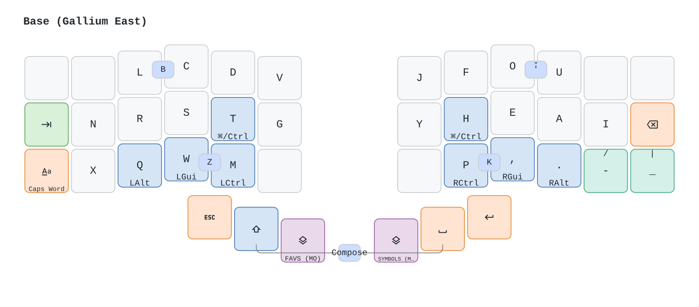
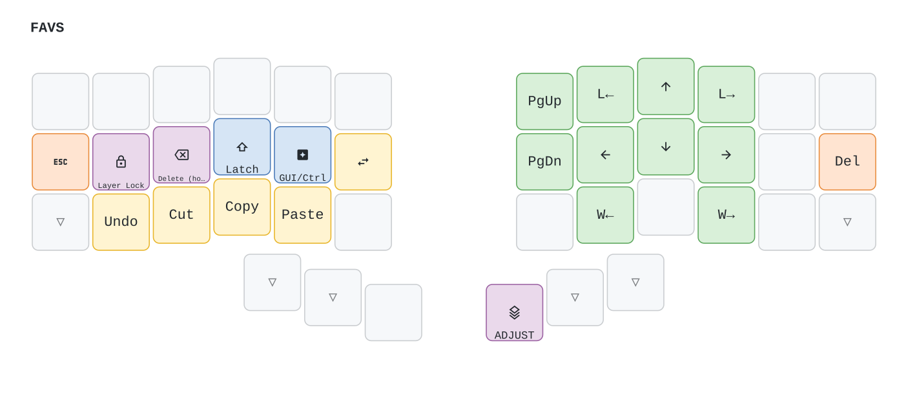
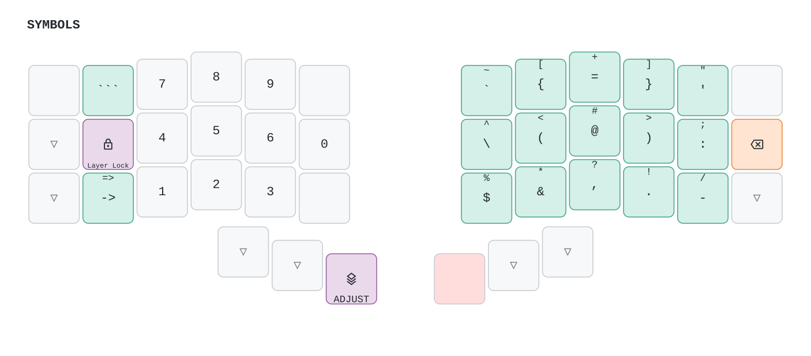
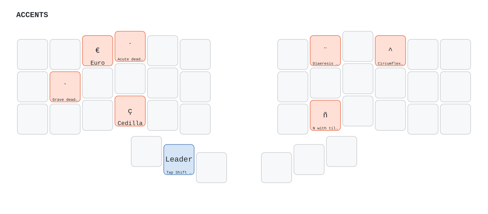

# Xavier's Split Keyboard Keymaps

QMK keymaps for two split keyboards sharing the same **3x6+3** layout (6 columns, 3 rows, 3 thumb keys per side). As a user who regularly switches between macOS and Linux, I needed keyboards that provide a consistent experience across devices.

## Keyboards

Both keyboards use the same physical layout and share the same keymaps via symlinks.

| Keyboard | MCU | Firmware |
|----------|-----|----------|
| **Kaly42** (`kaly/kaly42`) | STM32 | `.bin` |
| **Cantor Pro v3** (`42keebs/cantor_pro/v3/left`) | RP2040 | `.uf2` |

## Keymaps

### zen

A minimal, no-frills QWERTY keymap with just 3 layers:

- **BASE** — Standard QWERTY with Tab, Ctrl, Shift on the left column; Esc, GUI, and layer keys on thumbs
- **CODE** — Digits on the top row, brackets/symbols on home and bottom rows
- **NAV** — F-keys on top row, arrow keys and Home/PgDn/PgUp/End on home and bottom rows

No custom features, no macros, no combos (except bootloader). Good as a fallback or starting point.

#### Building zen

```bash
qmk compile -kb kaly/kaly42 -km zen
qmk compile -kb 42keebs/cantor_pro/v3/left -km zen
```

### crafted

This layout doesn't use the full range of keys available on the keyboards, it is effectiveky a (5.6.5)_2 keymap (where capital `X` is the home key):

```
 xxxxx   xxxxx
xxxxXx   xXxxxx
 xxxxx   xxxxx
     Xx xX 
```

It is quite feature-rich and opinionated, with an emphasis on **short finger travel**, **platform independence**, and **semantics over shortcuts**. Instead of memorizing different shortcuts for each platform, you use semantic commands that translate to the correct keystroke(s) for your current OS.

#### The keymap

<!-- KEYMAP DRAWER><-->




<!-- END KEYMAP DRAWER><-->


#### Ergonomics

- **Pinky fingers** only reach **downward** and **1U lateral (outward)** from home. No pinky ever reaches upward or diagonally. This motivated the **weak corners feature** (corner keys accessible via combos) and outer columns using **only the home row position**.
- **Index fingers** avoid inner diagonal reaches (the awkward hand twist toward B/N in QWERTY).
- **2-key thumb clusters** supplemented by the outer pinky home-row key, rather than 3-key thumb arcs — fewer keys means better proprioception and fewer misfires.

#### Features

- **Platform-aware semantic keys** — Undo/Cut/Copy/Paste, special characters (€, ç, ñ), text navigation, and application switching work identically on macOS and Linux. Inspired by [HandsDown](https://sites.google.com/alanreiser.com/handsdown).
- **Dead key accents** — Type accented characters (á, è, ô, ü, ñ...) naturally using OS-native dead key triggers.
- **Callum-style oneshot modifiers** — Tap a modifier, then tap your key. No holding required. Works seamlessly with semantic keys and shift morphing.
- **Weak corners** — Corner keys accessible via combos from adjacent positions, keeping fingers closer to home.
- **Alternative symbol systems** — Optional base layer symbol replacements (`XC_ALT_BASE_SYMBOLS`) and an alternative SYMBOLS layer (`XC_ALT_SYMBOLS_LAYER`) with inverted pairs and custom shift behaviors.
- **Multiple base layouts** — `qwerty`, `gallium`, `gallium_east`, `focal`, `graphite`, `radial`.

#### Technical Implementation

**Feature modularity** — Each feature is a self-contained `.c`/`.h` pair:

| Module | Purpose |
|--------|---------|
| `semantic_keys` | Platform-independent commands (Undo, Cut, Euro, etc.) |
| `dead_keys` | OS dead key triggers |
| `oneshot` | Callum-style oneshot modifiers |
| `mod_morph` | Shift morphing system |
| `os_control` | Runtime OS detection and switching |
| `alt_symbols` | Alternative base layer symbols |
| `alt_symbols_layer` | Alternative SYMBOLS layer configuration |

Custom keycodes use the `CUSTOM_KEYCODES()` macro pattern for auto-generated start markers and count values. Dead keys are processed before semantic keys, oneshot modifiers integrate cleanly with morphing, and key overrides are scoped to specific layers.

#### Building crafted

```bash
qmk compile -kb kaly/kaly42 -km crafted
qmk compile -kb 42keebs/cantor_pro/v3/left -km crafted
```

With a different base layout:

```bash
XC_LAYOUT=graphite qmk compile -kb kaly/kaly42 -km crafted
```

Feature flags (environment variables or `rules.mk`):

- **`XC_WEAK_CORNERS`** (default: `yes`) — Lazy corner keys via combos
- **`XC_ALT_BASE_SYMBOLS`** (auto-enabled with weak corners) — Alternative base layer symbols
- **`XC_ALT_SYMBOLS_LAYER`** (default: `no`) — Alternative SYMBOLS layer with inverted pairs

## Building All Targets

```bash
qmk userspace-compile
```

## Inspiration

- **Callum-style oneshot modifiers** — For superior ergonomics over home row mods
- **Precondition's approach** — Platform-aware key handling philosophy
- **HandsDown semantic keys** — Extended navigation and editing commands

## License

GPL-2.0-or-later (following QMK licensing)
