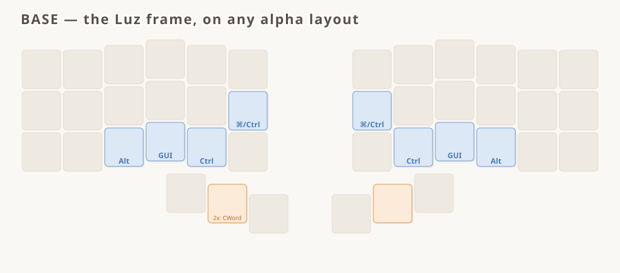
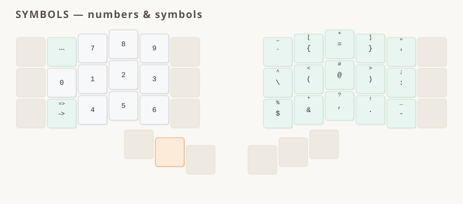
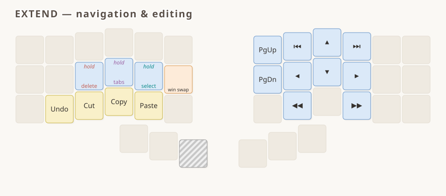
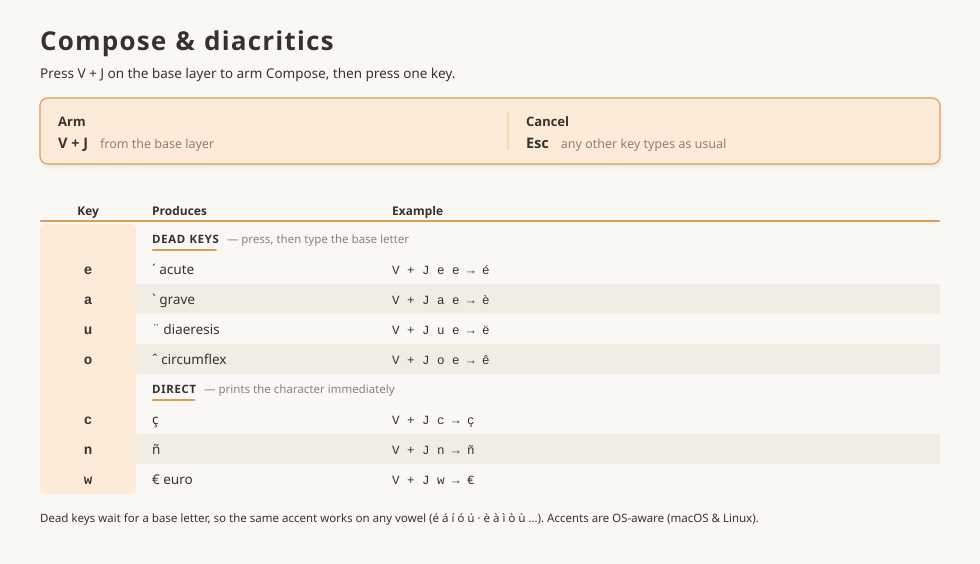

# Luz — keymap conventions for 3x6+3 keyboards


**Luz** (Spanish: *luz* /luθ/, "light") completes your favourite alpha layout (Graphite, Focal, Canary... or QWERTY if you will) and turns it into a ready-to-use keymap. Since an alpha layout typically only dictates where the letters go, Luz supplies everything else to actually be productive (symbols, numbers, navigation, editing, modifiers, accents) as one consistent, ready-made set of conventions and features.

Luz isn't itself a layout; it's the *framework* a layout drops into. Each concrete keymap is a
**variant**:

| Variant | Letters | Keymap |
|---------|---------|--------|
| **Luz for Gallium** | Gallium East | [`luz_for_gallium`](./keyboards/6x3_3/keymaps/luz_for_gallium/README.md) — the daily driver |
| **Luz for Enthium** | Enthium | [`luz_for_enthium`](./keyboards/6x3_3/keymaps/luz_for_enthium/README.md) — work in progress |
| **Luz for Colemak-DH** | Colemak Mod-DH (matrix) | [`luz_for_colemak_dh`](./keyboards/6x3_3/keymaps/luz_for_colemak_dh/README.md) — the portability test |
| **Luz for QWERTY** | QWERTY | [`luz_for_qwerty`](./keyboards/6x3_3/keymaps/luz_for_qwerty/README.md) — no new alphas to learn |

New variants are very welcome - see [Contributing variants](#contributing-variants).

(Another keymap, `zen`, is also in the repository but unrelated to Luz: a minimal QWERTY fallback for early bring-up or recovery. It might be deprecated eventually.)

## What you get, out of the box

> [!NOTE]
> The diagrams below are simplified to highlight each feature; they don't show every key. For a complete overview, see each variant's README ([Luz for Gallium](./keyboards/6x3_3/keymaps/luz_for_gallium/README.md) · [Luz for Enthium](./keyboards/6x3_3/keymaps/luz_for_enthium/README.md) · [Luz for Colemak-DH](./keyboards/6x3_3/keymaps/luz_for_colemak_dh/README.md) · [Luz for QWERTY](./keyboards/6x3_3/keymaps/luz_for_qwerty/README.md)).

- **Bottom-row mods, a plain thumb Shift, and an OS-aware Cmd/Ctrl.** Mods sit on the bottom row, under the less frequent letters, which reduces misfires. **Shift is a single plain key on the thumb** — not a dual-function key at all, so the modifier you hold most often has no timing to get wrong, and because thumbs are exempt from the handedness rule that one key works for both hands. Double-tap it for Caps Word. The **Cmd/Ctrl key adapts to the OS** (`⌘C` on macOS, `Ctrl-C` on Linux) and sits on the inner index column, the lightest pair in any layout. The home row itself carries no dual-function keys at all.

Every variant shares this same BASE *frame*:



- **A rethought symbol vocabulary.** The symbol set is redesigned for mnemonics and frequency, and every symbol's Shift gives a *related* glyph (`(` shifts to `<`, `{` to `[`, `=` to `+`). Learn the logic once and it holds everywhere.
- **Digits on the left hand.** The symbols layer turns the left hand into a number pad: `1 2 3` across the home row with `0` beside them, `4 5 6` below, `7 8 9` above. Deliberately *not* the calculator arrangement, which puts `4 5 6` on the home row — the digits you reach for most sit under your fingers instead. Tap Layer Lock (also left hand) and you can key figures in with the right hand off the keyboard entirely.
- **Modifiers that stay put while you're on the symbols layer.** Hold `Ctrl` (or `Alt`, or `Cmd`), enter the symbols layer, and you can *let the modifier go* — it stays held until you leave the layer. So no finger stays pinned on a modifier while the rest of that hand works the number pad, which is what `Ctrl`+digit otherwise asks of you. There's no timing to it: it's the ordinary hold, read differently because a layer is up. Shift is deliberately left out (you need it for the shifted symbols), and locking the layer releases everything.



- **A cursor cluster that doubles as an editor.** The right hand is a modifier-free inverted-T of arrows, with distance-from-home meaning distance-moved (character, word, line, page). **Triggers on the left hand** add extra modes onto that same cluster: one turns the motions into **select**, one into **delete** (by character/word/line), one drives **browser tabs**: the right hand keeps moving, the left hand picks the mode.




- **Diacritics through Compose.** Press `Shift` then `Space` — both thumbs, the same two keys on every variant — and the next key adds an accent (`é à ü ô ñ`, plus `ç` and `€` outright), so writing beyond plain ASCII is first-class, not an afterthought. Whatever Compose doesn't cover stays reachable on AltGr, for completeness.



---

## Room to grow

Luz fills the keys you actually need, but it **deliberately leaves blanks** on
several layers. Those are yours: map whatever suits
your workflow onto them, on any layer, without disturbing the shared frame.

**What's open, precisely.** The blank positions on every layer; the fills on the navigation
layer (the supplied editing commands are a default, not a requirement); which symbols a variant
privileges onto its base layer, and where; and what sits under the navigation-layer hold on the
left thumb — nothing in Gallium and Colemak-DH, the letter `R` in Enthium.

**What isn't.** The layer set and how you reach it, the mod positions, the symbol vocabulary and
its shift pairings, and Compose in its entirety — chord and output alike. [`LUZ.spec.md`](./LUZ.spec.md) opens with
the full list — it is a conformance checklist, so you can tell whether something is a Luz variant
without reading any code.

---

## Contributing variants

Luz is built to grow, and **new variants are very welcome.** If your favourite alpha layout (Graphite, Focal, Canary, Dvorak…) doesn't have one yet, take the existing variants as working examples to copy, and [`LUZ.spec.md`](./LUZ.spec.md) is the contract a variant follows.

Open an issue to discuss, or send a pull request: community-driven variants are exactly how Luz is meant to spread.

---

## Building

I have run these keymaps on:

| MCU | Example keyboard |
|-----|------------------|
| STM32 | **Kaly42** (`kaly/kaly42`) |
| RP2040 | **Cantor Pro v3** (`42keebs/cantor_pro/v3/left`) |

Build a single target, or all of them at once:

```bash
qmk compile -kb 42keebs/cantor_pro/v3/left -km luz_for_gallium
qmk userspace-compile
```

## Going further

- [`LUZ.spec.md`](./LUZ.spec.md) — the exact, implementation-facing contract: every layer, keycode, position, and rule.
- [`TUNING.md`](./TUNING.md) — four tap-hold settings left deliberately open, with the arguments on each side.
- The variant READMEs ([Luz for Gallium](./keyboards/6x3_3/keymaps/luz_for_gallium/README.md), [Luz for Enthium](./keyboards/6x3_3/keymaps/luz_for_enthium/README.md), [Luz for Colemak-DH](./keyboards/6x3_3/keymaps/luz_for_colemak_dh/README.md)) — diagrams and per-layout specifics.
- [`keyboards/6x3_3/luz/`](./keyboards/6x3_3/luz/) — the shared code the variants compile against.

## Inspiration

- **[HandsDown](https://sites.google.com/alanreiser.com/handsdown)** — semantic, platform-aware editing commands
- **[Miryoku](https://github.com/manna-harbour/miryoku)** — minimal, consistent layers built on home-row mods
- **[Seniply](https://stevep99.github.io/seniply/)** — the Extend layer: one-handed navigation and editing without leaving home
- **[Anymak](https://github.com/rpnfan/Anymak/)** — a complete keymap designed to sit on top of any alpha layout
- **[Gallium](https://github.com/GalileoBlues/Gallium) East** & **[Enthium](https://github.com/sunaku/enthium)** — the alpha layouts
- **Pascal Getreuer's QMK work** — Chordal Hold, Caps Word, and the wider tap-hold tuning vocabulary
- **Callum-style oneshot modifiers** — an early influence, since fully replaced by layer-scoped latches and plain momentary mods
- **[keymap-drawer](https://github.com/caksoylar/keymap-drawer)** — the layer diagrams

## License

GPL-2.0-or-later (following QMK licensing)
