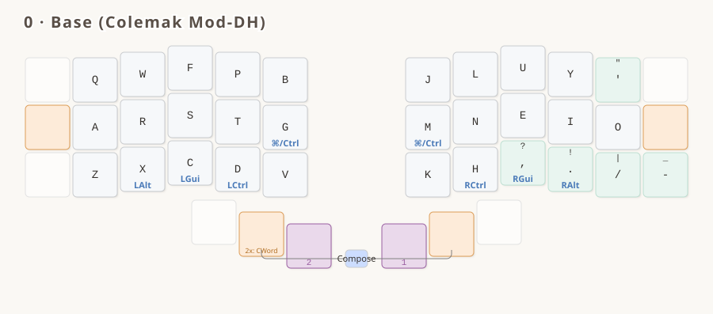
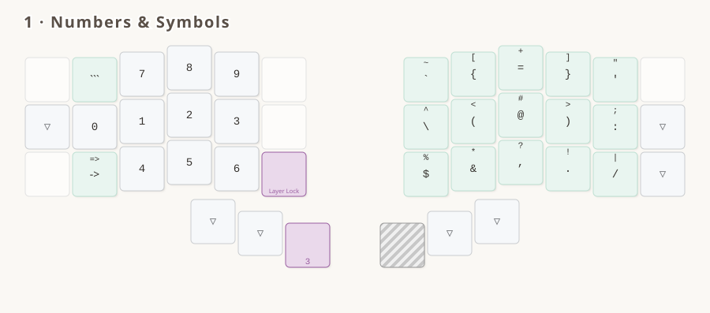
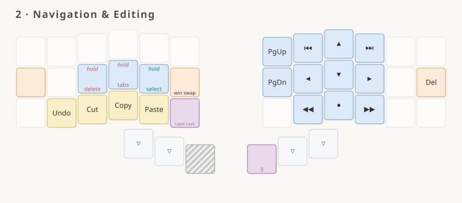
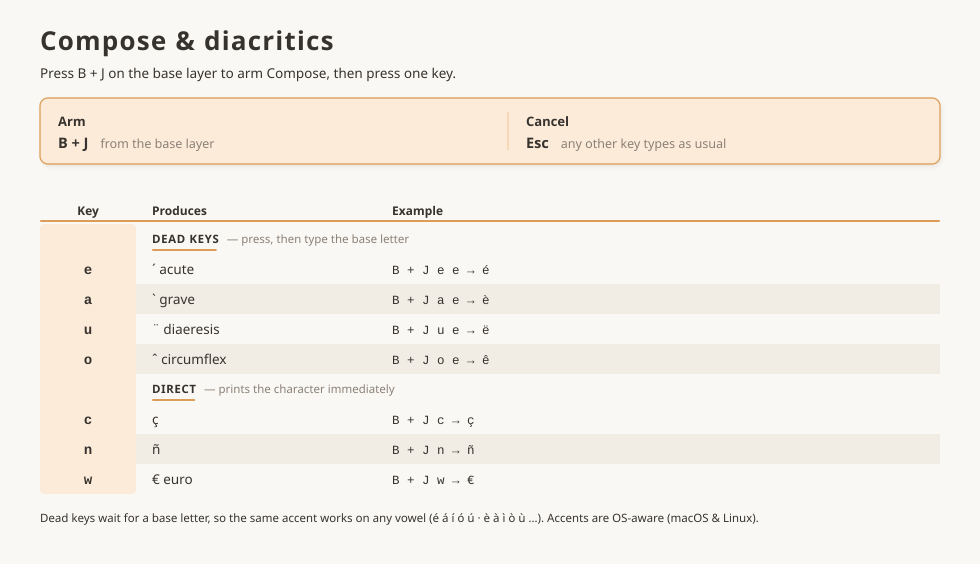

# Luz for Colemak-DH

`luz_for_colemak_dh` is the [Luz](../../../../README.md) conventions on **Colemak Mod-DH**
(matrix variant — the one intended for ortho and column-staggered boards, and the same
arrangement [Miryoku](https://github.com/manna-harbour/miryoku) and
[Seniply](https://stevep99.github.io/seniply/) ship on).

It exists as much to **test the Luz contract against a layout Luz didn't grow up with** as
to be a daily driver. Gallium East and Enthium were both chosen by the author; Colemak-DH
was not, and it is by far the most widely adopted alternative layout — so it is the honest
stress test of the claim that Luz drops onto any alphas.

The shared interaction model — layers, mods, symbols, Compose, navigation — is documented
in [the README](../../../../README.md) and specified in [`LUZ.spec.md`](../../../../LUZ.spec.md).
This page covers what's specific to this variant.

## Main features

- **Colemak Mod-DH (matrix)** base alphanum layout
- **Navigation cluster** with per-character/word/line and forward/backward motions, without modifiers
- **Select and Delete modes** in the navigation cluster
- **Compose key** for diacritics
- **Numpad on the left hand** keeps the right hand on the mouse
- **Mods latch on the symbols layer**: hold Ctrl/Alt/Cmd, enter the layer, let go — the mod stays until you leave, so `Ctrl`+digit is one-handed (Shift excluded; Layer Lock releases)
- **OS-aware keys**: Cut/Copy/Paste, app/window switching, unified Ctrl/Cmd key — consistent across macOS and Linux
- Symbols reorganized by frequency: opening brackets on the index column, and pairs kept together as much as possible

## The layers

<!-- KEYMAP DRAWER -->




<!-- END KEYMAP DRAWER -->



> [!NOTE]
> A printable PDF lives at [`keymap_drawer/luz_for_colemak_dh.pdf`](./keymap_drawer/luz_for_colemak_dh.pdf).

## Variant decisions

Everything below is a choice this variant makes within the latitude the spec allows.

- **`'` replaces `;` at pos 10**, the usual 30-key Colemak convention (Miryoku does the same).
  `;` stays reachable as `SY_COLN`'s shifted glyph on SYMBOLS.
- **`/` at 34, `-` at 35** — the reverse of Gallium East. `/` belongs to the Colemak-DH alpha
  block, so `-` takes the outer column. Both are still privileged BASE symbols, so the variant
  privileges the same five as Gallium: `' , . / -`.
- **SYMBOLS right hand** follows the Luz placement principles unchanged (open brackets on the
  index column, pairs stacked by kind, `=`/`@` on the middle finger). Only positions 34/35 differ
  from Gallium, tracking the BASE swap above — `-` is reached at 35 by fall-through, the same
  trick Gallium uses for `/`.
- **Thumbs** follow Gallium's: `— / ⇧ / MO(EXTEND)` and `LT(SYMBOLS, Enter) / Space / —`.
  Colemak-DH doesn't need to displace a letter onto a thumb the way Enthium does with `R`, so
  the EXTEND hold at 38 carries no tap and 36/41 are blank.

## Known friction: bottom-row mod load

**This is the one place Colemak-DH fits the Luz frame badly, and it is worth reading before
you flash it.**

Luz places the `Alt / GUI / Ctrl` trio on the bottom row specifically because that row holds
the *less frequent* letters, which is what keeps mod-tap misfires rare. Colemak-DH's bottom
row is `z x c d v` / `k h , . /` — so the trio lands on **X, C, D and H**.

| Variant | Letters under bottom-row mod-taps | Share of English letters |
|---|---|---|
| Luz for Gallium | Q, W, M, P | ~6.8% |
| Luz for Enthium | F, G, M, `'` | ~6.7% |
| **Luz for Colemak-DH** | **X, C, D, H** | **~13.3%** |

`H` at position 31 alone (6.1%) carries almost the entire Gallium load. `CHORDAL_HOLD`'s
opposite-hands rule and `FLOW_TAP_TERM 150` are doing considerably more work in this variant
than in the other two.

If it misfires in practice, the honest fix is a longer `TAPPING_TERM` for this variant —
which the Luz config contract currently forbids, since tap-hold tuning is declared shared.
That tension is a finding about the framework, not a defect in this keymap; see the note in
`keymap.c`.

## Reference tables

> [!NOTE]
> Searchable, greppable text twins of the diagrams above. Auto-generated from
> `keymap_drawer/make_*_page.py`.

<details>
<summary><strong>Navigation modes</strong></summary>

EXTEND cursor layer + Select / Delete / Tabs sub-modes

<!-- BEGIN NAV TABLE -->

| Key | Navigation (EXTEND layer) | Select (hold Sel) | Delete (hold Dl⊙) | Tabs (hold tab key) |
|-----|------|------|------|------|
| ◀ | Char left | Select char left | Backspace | Previous tab |
| ▶ | Char right | Select char right | Forward-delete | Next tab |
| ▲ | Line up | Select line up | · | New tab |
| ▼ | Line down | Select line down | · | Close tab |
| ◀◀ | Word back | Select word back | Delete word back | Page back |
| ▶▶ | Word forward | Select word forward | Delete word forward | Page forward |
| ⏮ | Line start | Select to line start | Delete to line start | · |
| ⏭ | Line end | Select to line end | Delete to line end | · |
| PgUp | Page up | Select page up | · | · |
| PgDn | Page down | Select page down | · | · |
| ● | · | · | · | Reopen tab |

`·` = the key keeps its Navigation role in that mode. Select and Delete are mutually exclusive. Tab actions are OS-aware (Firefox & Chrome, macOS & Linux).

<!-- END NAV TABLE -->

</details>

<details>
<summary><strong>Compose &amp; diacritics</strong></summary>

Press `B + J` together (the cross-hand inner-index pair, positions 5+6) while on BASE, then a key.

<!-- BEGIN DIACRITICS TABLE -->

| Key | Produces | Example |
|-----|----------|---------|
| `e` | ´ acute (dead key) | `B + J`, `e`, `e` → é |
| `a` | \` grave (dead key) | `B + J`, `a`, `e` → è |
| `u` | ¨ diaeresis (dead key) | `B + J`, `u`, `e` → ë |
| `o` | ˆ circumflex (dead key) | `B + J`, `o`, `e` → ê |
| `c` | ç | `B + J`, `c` → ç |
| `n` | ñ | `B + J`, `n` → ñ |
| `w` | € (euro) | `B + J`, `w` → € |

Armed from the **base layer** with B + J. Dead keys wait for a base letter, so the same accent works on any vowel; any unlisted key cancels.

<!-- END DIACRITICS TABLE -->

</details>

## Building

```bash
qmk compile -kb kaly/kaly42 -km luz_for_colemak_dh
qmk compile -kb 42keebs/cantor_pro/v3/left -km luz_for_colemak_dh
```

Diagrams and PDFs:

```bash
cd keymap_drawer && ./build_pdf.sh
```
