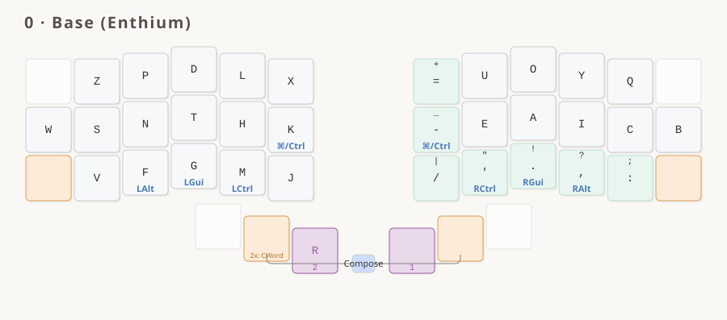
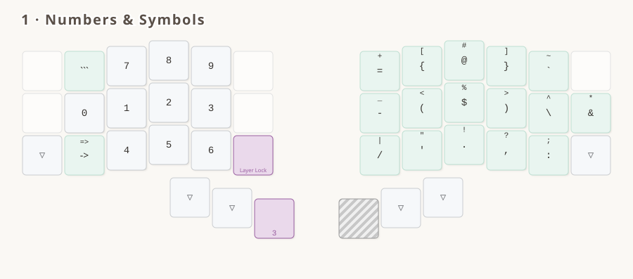
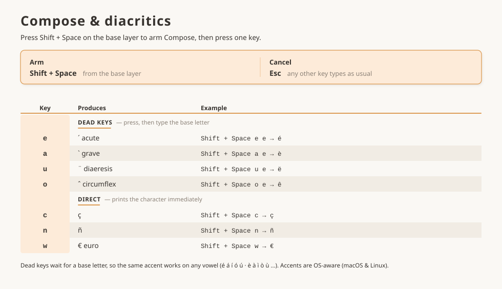

# Luz for Enthium *(WIP)*

`luz_for_enthium` ports the [Luz](../../../../README.md) conventions onto the **Enthium** alpha
layout, with the hands mirrored. EXTEND, its Select / Delete / Tabs sub-modes and ADJUST are shared
verbatim with the other variants; SYMBOLS keeps the shared numpad and vocabulary but arranges its
right-hand field for this layout, as the spec allows.

The shared interaction model — layers, mods, symbols, Compose, navigation — is documented in
[the README](../../../../README.md) and specified in [`LUZ.spec.md`](../../../../LUZ.spec.md).
This page covers what's specific to this variant.

> [!NOTE]
> Work in progress — the layout is still settling, so details here may change.

## Main features

- **Enthium** base alphanum layout, **hands mirrored**
- **Navigation cluster** with per-character/word/line and forward/backward motions, without modifiers
- **Select and Delete modes** in the navigation cluster
- **Compose key** for diacritics
- **Numpad on the left hand** keeps the right hand on the mouse
- **Mods latch on the symbols layer**: hold Ctrl/Alt/Cmd, enter the layer, let go — the mod stays until you leave, so `Ctrl`+digit is one-handed (Shift excluded; Layer Lock releases)
- **OS-aware keys**: Cut/Copy/Paste, app/window switching, unified Ctrl/Cmd key — consistent across macOS and Linux
- Symbols reorganized by frequency: opening brackets on the index column, and pairs kept together as much as possible

## The layers

<!-- KEYMAP DRAWER -->




<!-- END KEYMAP DRAWER -->



> [!NOTE]
> A printable PDF lives at [`keymap_drawer/luz_for_enthium.pdf`](./keymap_drawer/luz_for_enthium.pdf).

## Variant decisions

Everything below is a choice this variant makes within the latitude the spec allows.

- **The hands are mirrored.** Each of the three main rows is reversed left↔right, so the hands
  trade clusters while finger roles are preserved. The mod scheme is itself mirror-symmetric, so
  every letter keeps the same modifier — under the opposite hand.
- **The envelope sits at 24/35, not 12/23.** Tab goes bottom-left and Backspace bottom-right, and
  the home-row outer columns carry `W` and `B` instead. The Luz rule is unchanged (the envelope
  stays reachable on the overlays by transparency); only its positions move — which is exactly the
  per-variant freedom flagged in the spec's structural rule 3.
- **Seven privileged BASE symbols**, against Gallium's five: `=` (6), `-` (18), `/` (30), `'` (31),
  `.` (32), `,` (33), `:` (34). Mirroring frees the right-hand outer columns, so more of the set
  fits without a layer hold. Standalone `_` and `;` are Shift+`-` and Shift+`:`.
- **BASE 18 does double duty** as `RGUI_T(KC_MINS)`: tap `-`, hold the Cmd/Ctrl morph. SYMBOLS
  repeats `-` at 18 as a plain `SY_MINS`, so the glyph keeps its position on both layers while the
  morph stays BASE-only.
- **`R` rides the EXTEND thumb** — position 38 is `LT(EXTEND, KC_R)` rather than the bare
  `MO(EXTEND)` the other variants use, giving `R` the best key on the board. This is the one
  variant that puts a tap under that hold, and it has a cost — see below.

## Known friction: entering EXTEND right after typing

`is_flow_tap_key()` matches on the **tap** keycode, and `KC_R` is an alpha, so Flow Tap engages on
position 38: **EXTEND cannot be entered within `FLOW_TAP_TERM` (150 ms) of a keystroke.** Hold the
thumb too soon after typing and you get `r` instead of the navigation layer.

`LT(SYMBOLS, KC_ENT)` at 39 is unaffected, because `KC_ENT` is not in QMK's default flow-tap set.
That is precisely why the SYMBOLS thumb feels instant and the EXTEND thumb, in this variant only,
does not.

The fix is an `is_flow_tap_key()` override, which is deliberately **left open** — turning Flow Tap
off for 38 buys instant layer entry at the price of a fast `r` rolled into the next letter becoming
a layer activation, and `r` is ~6% of letters. Both sides of that trade, and the three other
tap-hold settings it interacts with, are written up in [`TUNING.md`](../../../../TUNING.md).

## Reference tables

> [!NOTE]
> Searchable, greppable text twins of the diagrams above. Auto-generated from
> `keymap_drawer/make_*_page.py`. The navigation and Compose behavior is shared Luz, so these
> match `luz_for_gallium`.

<details>
<summary><strong>Navigation modes</strong></summary>

EXTEND cursor layer + Select / Delete / Tabs sub-modes

<!-- BEGIN NAV TABLE -->

| Key | Navigation (EXTEND layer) | Select (hold Sel) | Delete (hold Dl⊙) | Tabs (hold tab key) |
|-----|------|------|------|------|
| ◀ | Char left | Select char left | Backspace | Previous tab |
| ▶ | Char right | Select char right | Forward-delete | Next tab |
| ▲ | Line up | Select line up | · | New tab |
| ▼ | Line down | Select line down | · | Close tab |
| ◀◀ | Word back | Select word back | Delete word back | Page back |
| ▶▶ | Word forward | Select word forward | Delete word forward | Page forward |
| ⏮ | Line start | Select to line start | Delete to line start | · |
| ⏭ | Line end | Select to line end | Delete to line end | · |
| PgUp | Page up | Select page up | · | · |
| PgDn | Page down | Select page down | · | · |
| ● | · | · | · | Reopen tab |

`·` = the key keeps its Navigation role in that mode. Select and Delete are mutually exclusive. Tab actions are OS-aware (Firefox & Chrome, macOS & Linux).

<!-- END NAV TABLE -->

</details>

<details>
<summary><strong>Compose &amp; diacritics</strong></summary>

Press `Shift` then `Space` (the thumb pair, positions 37+40) while on BASE, then a key. Shift must come first — see [`LUZ.spec.md`](../../../../LUZ.spec.md#compose).

<!-- BEGIN DIACRITICS TABLE -->

| Key | Produces | Example |
|-----|----------|---------|
| `e` | ´ acute (dead key) | `Shift + Space`, `e`, `e` → é |
| `a` | \` grave (dead key) | `Shift + Space`, `a`, `e` → è |
| `u` | ¨ diaeresis (dead key) | `Shift + Space`, `u`, `e` → ë |
| `o` | ˆ circumflex (dead key) | `Shift + Space`, `o`, `e` → ê |
| `n` | ˜ tilde (dead key) | `Shift + Space`, `n`, `n` → ñ |
| `c` | ç | `Shift + Space`, `c` → ç |
| `w` | € (euro) | `Shift + Space`, `w` → € |

Armed from the **base layer** with Shift + Space. Dead keys wait for a base letter, so the same accent works on any base letter; any unlisted key cancels.

<!-- END DIACRITICS TABLE -->

</details>

## Building

```bash
qmk compile -kb kaly/kaly42 -km luz_for_enthium
qmk compile -kb 42keebs/cantor_pro/v3/left -km luz_for_enthium
```
