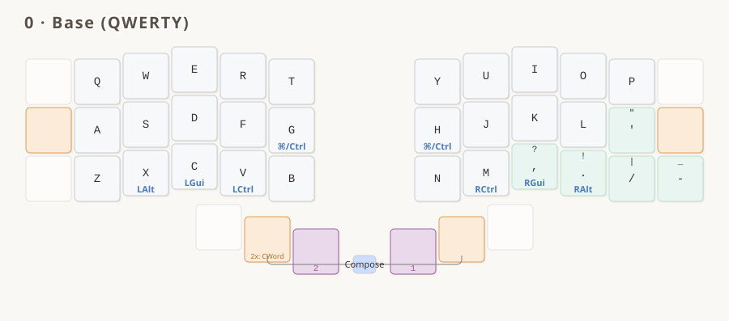
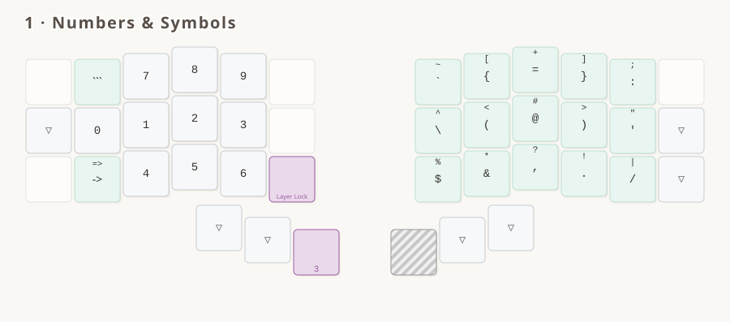
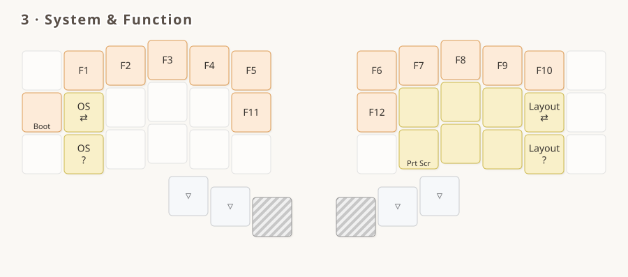
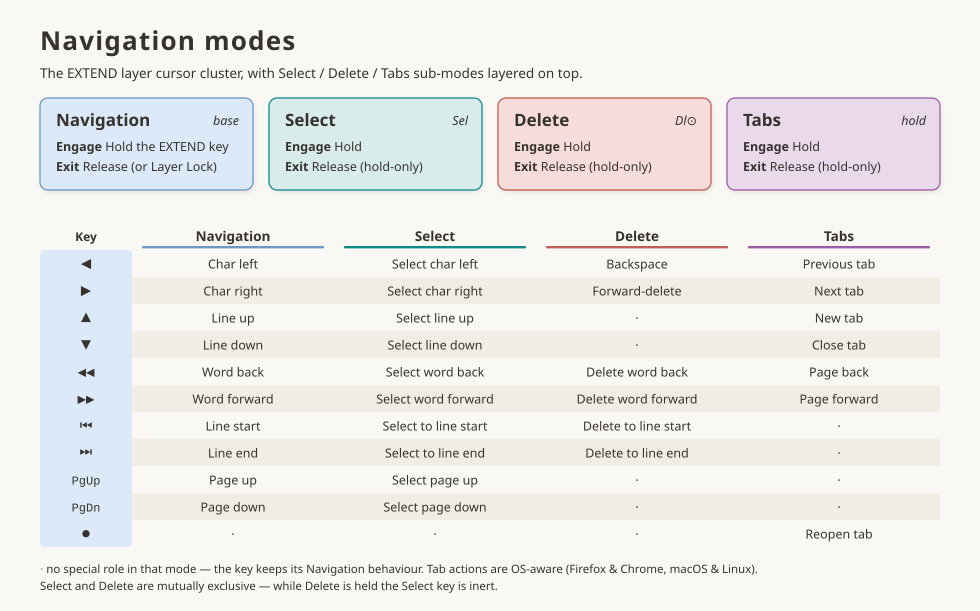
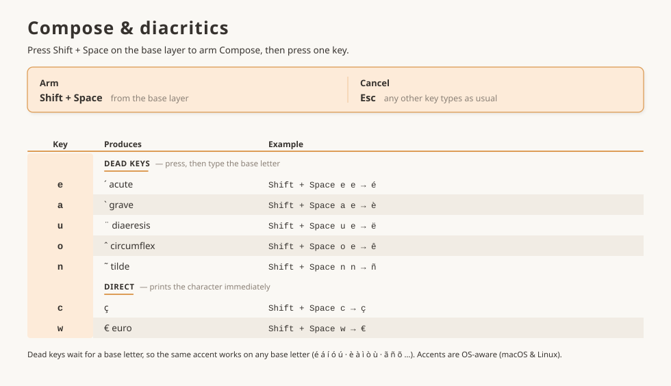

# Luz for QWERTY

`luz_for_qwerty` is the [Luz](../../../../README.md) conventions on plain **QWERTY**.

It exists to answer the obvious objection to a framework built around alternative layouts:
*fine, but does it work if I don't want to relearn my alphas?* Gallium East, Enthium and
Colemak-DH were all designed — letters placed deliberately, by someone optimising something.
QWERTY was not. If the contract holds here it holds anywhere, and if it doesn't, the place it
breaks is worth knowing.

It is also the low-commitment way in: everything Luz actually gives you — the layers, the
symbol set, Compose, the navigation cluster — is above BASE, and none of it requires changing
where the letters are.

The shared interaction model — layers, mods, symbols, Compose, navigation — is documented
in [the README](../../../../README.md) and specified in [`LUZ.spec.md`](../../../../LUZ.spec.md).
This page covers what's specific to this variant.

## Main features

- **QWERTY** base alphanum layout — unchanged, except `'` in place of `;`
- **Navigation cluster** with per-character/word/line and forward/backward motions, without modifiers
- **Select and Delete modes** in the navigation cluster
- **Compose key** for diacritics
- **Numpad on the left hand** keeps the right hand on the mouse
- **Mods latch on the symbols layer**: hold Ctrl/Alt/Cmd, enter the layer, let go — the mod stays until you leave, so `Ctrl`+digit is one-handed (Shift excluded; Layer Lock releases)
- **OS-aware keys**: Cut/Copy/Paste, app/window switching, unified Ctrl/Cmd key — consistent across macOS and Linux
- Symbols reorganized by frequency: opening brackets on the index column, and pairs kept together as much as possible

## The layers

<!-- KEYMAP DRAWER -->




<!-- END KEYMAP DRAWER -->



> [!NOTE]
> A printable PDF lives at [`keymap_drawer/luz_for_qwerty.pdf`](./keymap_drawer/luz_for_qwerty.pdf).

## Variant decisions

Everything below is a choice this variant makes within the latitude the spec allows.

- **`'` replaces `;` at pos 22**, the usual 30-key convention (Miryoku does the same).
  `;` stays reachable as `SY_COLN`'s shifted glyph on SYMBOLS.
- **Privileged BASE symbols are `' , . / -`** — the same five as Gallium East and Colemak-DH.
  QWERTY hands `, . /` over at 32/33/34 for free, exactly where Colemak-DH has them, so only
  `-` had to be placed, at 35.
- **SYMBOLS swaps `'` and `:`** against the other variants: `'` at 22, `:` at 10. This is not
  taste. QWERTY's apostrophe key sits on the *home* row where Colemak-DH's sits on the top row,
  and cross-layer consistency requires a symbol on both BASE and SYMBOLS to keep its position —
  so `'` takes 22 and `:` inherits the slot it vacated. **It is the only change the layout
  forces above BASE**, in the one place the spec marks as free (the SYMBOLS right-hand field).
- **Thumbs** follow Gallium's: `— / ⇧ / MO(EXTEND)` and `LT(SYMBOLS, Enter) / Space / —`.
  Nothing needs displacing onto a thumb the way Enthium does with `R`.

## Known friction: the morph sits on H

**This is the one place QWERTY fits the Luz frame badly, and it is worth reading before you
flash it.**

Luz puts the Cmd/Ctrl morph on the inner index pair (17/18) because that column holds each
layout's *least* frequent keys. On QWERTY, 17/18 is **G and H** — and H is the 8th most common
letter in English.

| Variant | Letters under the morph | Share of English letters |
|---|---|---|
| Luz for Enthium | K, `-` | ~0.8% |
| Luz for Gallium | G, Y | ~4.0% |
| Luz for Colemak-DH | G, M | ~4.4% |
| **Luz for QWERTY** | **G, H** | **~8.1%** |

`H` alone (6.1%) is heavier than either of the other index pairs entire. Every `h` you type is
a tap-hold decision that the other variants don't pay.

Two mitigating facts, both real. `gh` *is* a cross-hand bigram (*night*, *through*), which is
precisely the case Chordal Hold does not guard — but both letters are alphas, so **Flow Tap**
covers it, and `gh` is effectively never word-initial, which is where Flow Tap's protection
lapses. And QWERTY's **bottom row is fine**: `X C V` / `M` is ~6.3%, in line with Gallium's
~6.8% and far below Colemak-DH's ~13.3%.

So QWERTY and Colemak-DH stress the frame in *different* places — bottom row for one, index
column for the other. Neither is fixable by moving Luz's mods, because the whole point is that
the positions don't move. If the morph misfires in practice, the levers are the ones in
[`TUNING.md`](../../../../TUNING.md), and the tension is the same one Colemak-DH records: a
per-variant `TAPPING_TERM` would help, and the config contract currently forbids it.

## Reference tables

> [!NOTE]
> Searchable, greppable text twins of the diagrams above. Auto-generated from
> `keymap_drawer/make_*_page.py`.

<details>
<summary><strong>Navigation modes</strong></summary>

EXTEND cursor layer + Select / Delete / Tabs sub-modes

<!-- BEGIN NAV TABLE -->

| Key | Navigation (EXTEND layer) | Select (hold Sel) | Delete (hold Dl⊙) | Tabs (hold tab key) |
|-----|------|------|------|------|
| ◀ | Char left | Select char left | Backspace | Previous tab |
| ▶ | Char right | Select char right | Forward-delete | Next tab |
| ▲ | Line up | Select line up | · | New tab |
| ▼ | Line down | Select line down | · | Close tab |
| ◀◀ | Word back | Select word back | Delete word back | Page back |
| ▶▶ | Word forward | Select word forward | Delete word forward | Page forward |
| ⏮ | Line start | Select to line start | Delete to line start | · |
| ⏭ | Line end | Select to line end | Delete to line end | · |
| PgUp | Page up | Select page up | · | · |
| PgDn | Page down | Select page down | · | · |
| ● | · | · | · | Reopen tab |

`·` = the key keeps its Navigation role in that mode. Select and Delete are mutually exclusive. Tab actions are OS-aware (Firefox & Chrome, macOS & Linux).

<!-- END NAV TABLE -->

</details>

<details>
<summary><strong>Compose &amp; diacritics</strong></summary>

Press `Shift` then `Space` (the thumb pair, positions 37+40) while on BASE, then a key. Shift must come first — see [`LUZ.spec.md`](../../../../LUZ.spec.md#compose).

<!-- BEGIN DIACRITICS TABLE -->

| Key | Produces | Example |
|-----|----------|---------|
| `e` | ´ acute (dead key) | `Shift + Space`, `e`, `e` → é |
| `a` | \` grave (dead key) | `Shift + Space`, `a`, `e` → è |
| `u` | ¨ diaeresis (dead key) | `Shift + Space`, `u`, `e` → ë |
| `o` | ˆ circumflex (dead key) | `Shift + Space`, `o`, `e` → ê |
| `n` | ˜ tilde (dead key) | `Shift + Space`, `n`, `n` → ñ |
| `c` | ç | `Shift + Space`, `c` → ç |
| `w` | € (euro) | `Shift + Space`, `w` → € |

Armed from the **base layer** with Shift + Space. Dead keys wait for a base letter, so the same accent works on any base letter; any unlisted key cancels.

<!-- END DIACRITICS TABLE -->

</details>

## Building

```bash
qmk compile -kb kaly/kaly42 -km luz_for_qwerty
qmk compile -kb 42keebs/cantor_pro/v3/left -km luz_for_qwerty
```

Diagrams and PDFs:

```bash
cd keymap_drawer && ./build_pdf.sh
```
